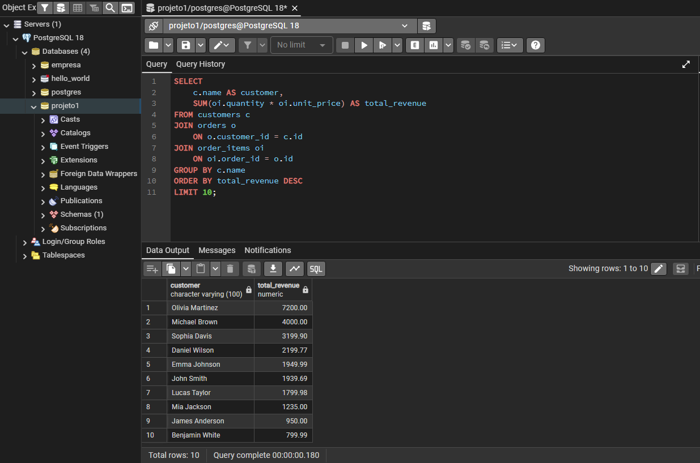
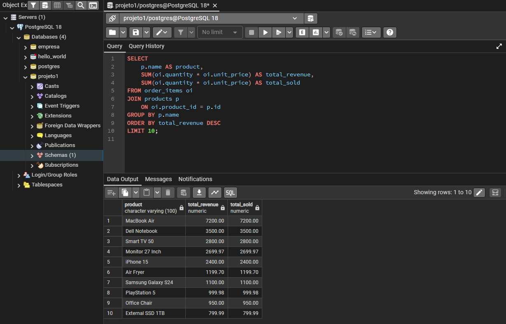
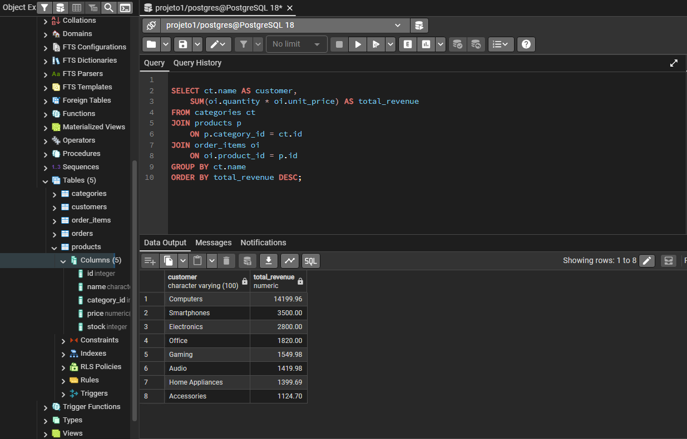
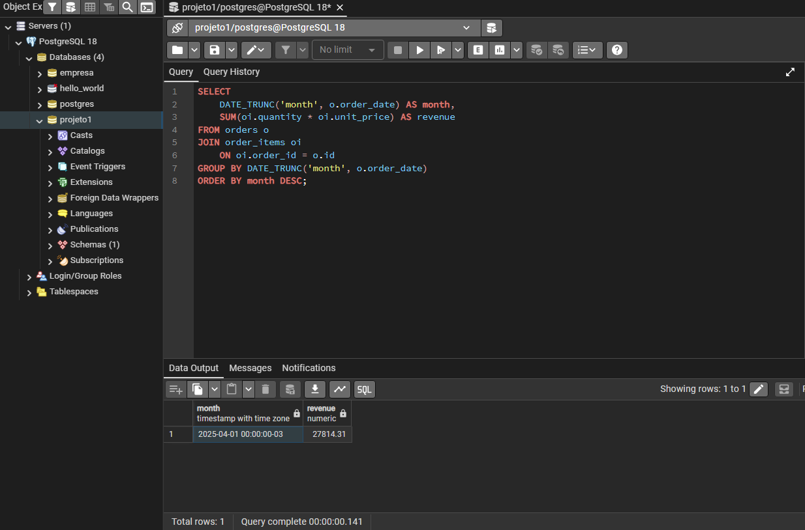

# E-commerce SQL Analysis Project

## Objective
Analyze e-commerce data using PostgreSQL to generate business insights.

## Technologies Used
- PostgreSQL
- SQL
- VSCode
- pgAdmin

## Database Tables
- customers
- orders
- order_items
- products
- categories

## Analysis Performed
- Monthly Revenue Analysis
- Top Customers by Revenue
- Top Products by Revenue
- Revenue by Category
- Order Revenue Analysis
- Orders by Status
- Customers Without Orders
- Average Order Value

## Project Structure
```text
ecommerce-sql-analysis/
├── README.md
├── analysis_queries.sql
└── images/
```

## Query Examples

### Top Customers by Revenue


### Top Products by Revenue



### Revenue By Category


### Monthly Revenue Analysis



